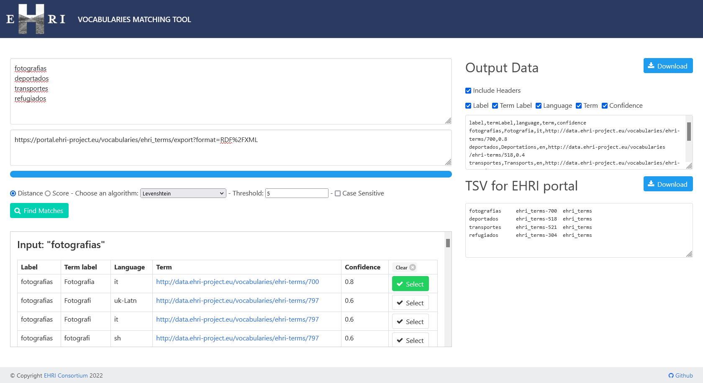

EHRI Entity Matching Tool
=========================

A small (prototype) single page app which matches a list of names against a Solr index
of entities (places, people, corporate bodies) and lets the user refine and export
structured (CSV) data.

The Solr schema (on `coredir`) is not yet optimised and is quite slow to index due to the
use of a Beider Morse filter analyser for the optional phonetic matching.

The datasets used are the Geonames [`allCountries.zip`](https://download.geonames.org/export/dump/allCountries.zip) 
and [this set](https://portal.ehri-project.eu/api/datasets/nmfUu4u9Hr) of entities from the EHRI portal database.

You can set up a dev instance by running `sudo docker-compose up` from the project directory, which will start an 
instance of Solr 6.6.6 using the supplied core config on port 8984. You can then run the `./bin/ingest` script to 
download the datasets and import them into Solr using, respectively, the CSV and JSON update handlers. Note: this will
take quite some time since Solr has to ingest ~1.5GB of Geonames data.

Running the app on port 9000 can be done by starting the SBT shell and running the `run` command.

